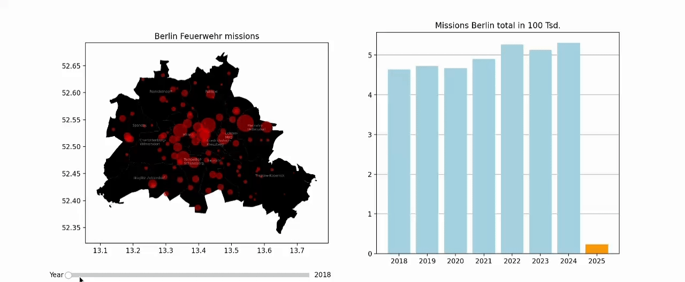

# Berlin Feuerwehr Regional Mission Visualization

This project automatically groups districts to then plot a graphical representation of the mission frequency per year in proprtional circles on the berlin map. The data in the repository is from ***January-17-2025***. Its included to make a fast execution possible.
To fetch the newest data run `make fetch_data`. This automatically graps all available regional data. This may take a while. This data is then stored in merged_mission_count.csv so the next execution takes this data again.

***DISCLAIMER: The fetched Geo data might not fit the actual location from the data because it only relies on the results from geopy. A few locations like Parkviertel are not found.***

## Demo

## Requirements
- Python 3.6 or higher
- MAKE, to install the dependencies automatically
- dependecies which get installed in the venv in the section below

## Setup Instructions

- `git clone https://github.com/alexehrlich/BerlinerFeuerwehr_DataVisualizer.git` 
- `cd`to that folder
- `make setup`to automatically create virtual environment and install dependecies
- `make run`to run the code
- Only `make` combines setup and run
- `make fetch_data` grabs the newest regional data from Berliner Feuerwehr Open Data

If you don't have make you can create the venv manually and install the dependencies from requirements.txt manually.

## Resources
- Berliner Feuerwehr Data: https://github.com/Berliner-Feuerwehr/BF-Open-Data/tree/main/Datasets/Regional_Data
- Berlin Shapefiles: https://daten.odis-berlin.de
- Location Data: OpenStreetMap.org
